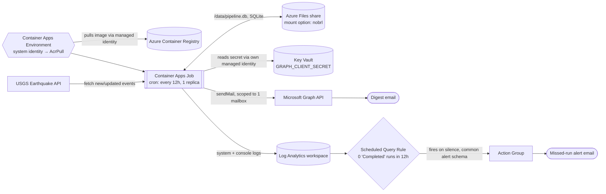

# Scheduled Earthquake Ingestion Pipeline

A job that runs on a schedule in the cloud, pulls new/updated earthquakes from
USGS's public feed, stores them idempotently, and emails a digest when
something significant happens — with no human touching it between runs. This
is the generic "poll a source, reconcile against what we have, tell a human
what changed" pattern that most scheduled business automation is a variation
of.

## What it does

- Runs every 12 hours in Azure Container Apps and fetches new or updated
  earthquakes from USGS.
- Stores every record in SQLite — no magnitude threshold on ingestion.
- Sends an HTML email digest via Microsoft Graph whenever a run includes a
  magnitude 4.5+ earthquake.
- Alerts separately if the job **stops running at all** — not just if it
  errors.
- Logs one structured JSON line per run (records fetched, inserted, updated,
  skipped, and duration), so "when did this start getting slower" is a log
  query, not a guess.

## Architecture



Every component in this diagram is actually deployed — nothing here is
aspirational.

## Why a natural key, not autoincrement

The `earthquakes` table is keyed on USGS's own event `id`
(`us7000abcd`-style), not a generated autoincrement column. USGS guarantees
that ID is stable and unique for the life of the event, which is what makes
replays safe: re-running the same time window is a plain
`INSERT ... ON CONFLICT(id) DO UPDATE`, not a dedup problem. An autoincrement
key would make "did I already have this row" a query instead of a language
feature.

## Schema

```sql
CREATE TABLE earthquakes (
    id        TEXT PRIMARY KEY,  -- USGS event id, e.g. "us7000abcd"
    time      INTEGER NOT NULL,  -- event origin time, epoch ms
    updated   INTEGER NOT NULL,  -- USGS last-revised time, epoch ms
    magnitude REAL,
    place     TEXT,
    longitude REAL,
    latitude  REAL,
    depth     REAL               -- km
);

CREATE TABLE pipeline_state (
    key   TEXT PRIMARY KEY,
    value TEXT
);  -- one row: watermark_updated_ms
```

`pipeline_state` holds the watermark — the timestamp of the last successful
run. Every run fetches `updatedafter=<watermark>`, not "the last 24 hours,"
so a skipped run doesn't silently lose data; the next run just catches up
from where it actually left off.

## Deployment & current status

Deployed to Azure Container Apps Jobs (`rg-earthquake-pipeline`, East US):
ACR → Container Apps Environment (system-assigned identity, `AcrPull`-only
on that one ACR) → Container Apps Job on a 12h cron, 1 replica, ingress
disabled, 0.5 vCPU / 1 GiB, ~49 MB image.

**Verified working:** manual executions succeed end to end (image pull →
container start → USGS fetch → SQLite upsert → watermark persisted → digest
sent when notable), the database persists correctly across separate
executions via the mounted Azure Files share, and the missed-run alert fires
and delivers email.

**Not yet complete:** the acceptance criterion of **7 consecutive days of
unattended, cron-triggered operation is still pending** — every execution to
date has been a manual verification run, not a natural schedule firing. The
schedule (`0 */12 * * *`) is live and will start accumulating that record
going forward.

## Security & permissions

Every credential the job needs is scoped to exactly what it does, nothing
more:

| Identity | Role | Scope | Why |
|---|---|---|---|
| Container Apps Environment (system-assigned) | `AcrPull` | one ACR | Pull the job's image. Nothing else. |
| Container Apps Job (system-assigned) | `Key Vault Secrets User` | one Key Vault | Read `GRAPH_CLIENT_SECRET` at startup. Can't manage the vault or any other resource. (Key Vault RBAC doesn't support per-secret scoping, so vault-scope is the narrowest available role — the vault holds only this one secret.) |
| Graph app registration | `Mail.Send` (Application) | scoped via Exchange RBAC to one mailbox | Send the digest as that mailbox only — not as any user in the tenant, which is the default blast radius of an unscoped `Mail.Send` grant. |

Setting up that Key Vault row needed one temporary widening: writing the
secret's value requires vault-scoped *write* access, which my own account
(Owner at subscription scope) doesn't get automatically under Key Vault's
RBAC mode — so I self-granted `Key Vault Secrets Officer`, scoped to just
that vault, to set it once. The job's own runtime identity only ever got
`Key Vault Secrets User` (read-only) — it can fetch the secret, not change
it.

`GRAPH_CLIENT_SECRET` is never a plaintext value anywhere in Azure — the
job's secret definition is a Key Vault reference
(`keyVaultUrl` + `identity: system`), resolved at runtime. It also never
touches the container image: the `Dockerfile` only copies `pipeline.py` and
`requirements.txt`, and `.env` is git-ignored and has never been committed
(`git log -p | grep -i "key|secret|password"` across the full history turns
up only variable names and schema column names, never a value).

**Known open item:** currently only the deploying account has any RBAC on
these resources — nobody else has been granted permission to start or manage
the job. That's the safest possible default, but it's an explicit decision
still pending, not an oversight.

## Azure Files persistence, and why `nobrl` was required

`/data/pipeline.db` lives on an Azure Files share (SMB), mounted read/write
into the job. Azure Files over SMB enforces mandatory byte-range file
locking; SQLite's default locking model expects POSIX/`fcntl`-style advisory
locks. The two are incompatible — the very first write to the database
(the schema's `CREATE TABLE IF NOT EXISTS`) failed to acquire a lock and the
container crashed with exit code 1, before a replica even showed up in logs.
This is a documented limitation, not a code bug: SQLite's own docs warn
against network filesystems for exactly this reason, and it's shown up
before in Container Apps specifically.

**Fix:** the volume is mounted with `mountOptions: nobrl`, which disables
SMB's enforced byte-range locking. That's safe here specifically because the
job runs one replica at a time (`parallelism: 1`) — there's no real
concurrent-write scenario for the disabled locking to protect against.

## Missed-run monitoring

A job that errors loudly is fine — the interesting failure is a job that
quietly stops being scheduled. That's covered separately from application
error handling:

- **Scheduled Query Rule** (`alert-earthquake-pipeline-missed-run`) queries
  Log Analytics every hour for a `Completed` execution of the job in the
  trailing 12 hours (the schedule interval). Fires if there are zero.
- **Action Group** sends email on fire.

This was verified to *actually deliver*, not just exist: an initial live
fire test produced a "Fired" alert with `isSuppressed: false` but no email
arrived. Isolating the cause (ruling out spam filtering, Alert Processing
Rules, and unsubscribe status via Azure's own troubleshooting checklist,
then a native Action Group test-notification, which *did* arrive) narrowed
it to the email receiver's `useCommonAlertSchema` setting — `false`
(legacy format) silently failed for this alert type, `true` (common
schema) delivered correctly. Confirmed with a disposable side-by-side test
against both settings before applying the fix to the real Action Group, then
one more live fire against the real, fixed configuration — email received.

## Failure handling, recovery, and blast radius

- **Transient API failures:** the USGS fetch is wrapped in `tenacity`
  (3 attempts, exponential backoff with jitter). Verified with a controlled
  test that mocked two `503`s followed by a success against the real
  decorated function — confirmed exactly 3 attempts, real measured delays
  between them, and a clean successful result afterward.
- **Killed mid-run:** all of a run's writes (row upserts + watermark update)
  happen in one SQLite transaction, committed once at the end. Verified with
  a controlled test: a process was `SIGKILL`ed after writing but before
  committing — the database came back with `PRAGMA integrity_check: ok` and
  state byte-for-byte identical to before the run started, and a subsequent
  run recovered cleanly with no duplicate or missing rows.
- **Blast radius:** the pipeline only reads a public API and writes to its
  own database. Its one external side effect is sending email, and that's
  scoped to a single mailbox (see Security above). There is no delete/write
  access to anything outside its own data.

## Testing & verification evidence

- `test_idempotency.py` (committed, run via `python test_idempotency.py`):
  proves 5 repeated upserts of the same batch leave the row count unchanged,
  and that malicious USGS-sourced strings (`<script>` in a place name, a
  quote-breaking event ID) can't inject into the digest HTML.
- Retry/backoff and kill-mid-run recovery were verified with one-off
  controlled tests against the real code (not reimplemented logic) during
  development — see above for what each proved. These aren't yet part of
  the committed suite; promoting them to permanent regression tests is a
  natural next step.
- Live in Azure: a second manual run correctly read back the watermark
  persisted by the first (rather than re-backfilling), and its upsert
  counts (1 inserted, 2 updated, 0 skipped for a 3-record overlapping fetch)
  confirm no duplicate rows are created on repeated real runs.

## Results (honest numbers, not projected)

- First production write to `/data/pipeline.db`: 590 records backfilled
  from a 24-hour historical window in 1.9 seconds.
  The following manual run, 2 minutes later, correctly processed only the
  3 records that had changed since (in 0.4 seconds) — proof it's doing
  incremental fetches, not full rescans.
- Container image: ~49 MB.
- Uptime/unattended-days and a real records/day rate aren't reported here on
  purpose — see "Not yet complete" above. Numbers here are only from
  verification runs, not production operation, and this section will be
  updated once there's an honest week of unattended data.

## Running locally

```bash
pip install -r requirements.txt
cp .env.example .env   # fill in values, never commit .env
python pipeline.py          # one run
python test_idempotency.py  # idempotency check
```

## Running in Azure (shape of the deployment)

Roughly, in this order: build/push the image to ACR
(`az acr build`) → create a Container Apps Environment with a
system-assigned identity, grant it `AcrPull` on the ACR → register the Azure
Files share with the environment → create the Container Apps Job from that
image on a 12h cron, mount the file share at `/data` with
`mountOptions: nobrl` → create a Key Vault, give the job's own
system-assigned identity `Key Vault Secrets User` on it, store
`GRAPH_CLIENT_SECRET` there, and point the job's secret at it via
`keyVaultUrl` + `identity: system` → create an Action Group (email,
`useCommonAlertSchema: true`) and a Scheduled Query Rule on the job's Log
Analytics workspace that fires when 12 hours pass with zero `Completed`
executions.

## What I'd do differently / production considerations

- **SQLite on Azure Files is a workaround, not a solution.** `nobrl` fixes
  the symptom; a managed database (Postgres, or even Azure Table Storage for
  this data shape) would avoid the whole class of network-filesystem-locking
  problems instead of disabling a safety mechanism to route around it.
- **Infrastructure as code.** This was built via CLI/Portal iteration, which
  is how the `nobrl` and common-alert-schema issues got found — the hard
  way, in production, after the fact. Bicep/Terraform with a review step
  would surface both in a plan diff before deployment.
- **Test the alert's actual delivery during setup, not after.** "The alert
  fired" and "the email arrived" turned out to be different questions here.
  A one-time delivery smoke test belongs in initial setup, not
  troubleshooting.
- **CI/CD for the image build**, instead of manual `az acr build`.
- **Decide who else gets job access** before calling this done — currently
  only the deploying account has any permission on these resources.
- **Finish the 7-day unattended run** before this is actually "done" against
  its own acceptance criteria.
