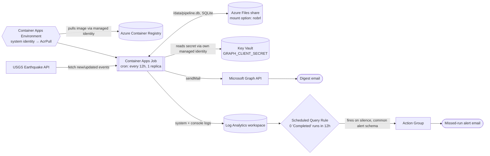

# Scheduled Earthquake Ingestion Pipeline

A scheduled job that pulls new/updated earthquakes from USGS's public feed,
stores them idempotently, and emails a digest when something significant
happens — unattended, on a cron.

## What it does

- Runs every 12 hours in Azure Container Apps and fetches new or updated
  earthquakes from USGS.
- Stores every record in SQLite — no magnitude threshold on ingestion.
- Sends an HTML email digest via Microsoft Graph whenever a run includes a
  magnitude 4.5+ earthquake.
- Alerts separately if the job **stops running at all** — not just if it
  errors.
- Logs one structured JSON line per run (fetched/inserted/updated/skipped
  counts, duration).

## Architecture



## Schema

```sql
CREATE TABLE earthquakes (
    id        TEXT PRIMARY KEY,  -- USGS event id, e.g. "us7000abcd"
    time      INTEGER NOT NULL,  -- event origin time, epoch ms
    updated   INTEGER NOT NULL,  -- USGS last-revised time, epoch ms
    magnitude REAL,
    place     TEXT,
    longitude REAL,
    latitude  REAL,
    depth     REAL               -- km
);

CREATE TABLE pipeline_state (
    key   TEXT PRIMARY KEY,
    value TEXT
);  -- one row: watermark_updated_ms
```

`id` is USGS's own event ID, not an autoincrement column — it's stable and
unique for the life of the event, which is what makes reruns safe
(`INSERT ... ON CONFLICT(id) DO UPDATE`, not a dedup problem). `pipeline_state`
holds the watermark of the last successful run; every run fetches from
there instead of "the last 24 hours," so a skipped run doesn't lose data.

## Status

Deployed to Azure Container Apps Jobs (`rg-earthquake-pipeline`, East US) on
a 12h cron, 1 replica. Manual verification runs succeed end to end — image
pull, USGS fetch, SQLite upsert, watermark persistence, digest send, and the
missed-run alert all confirmed working.

**Not yet complete:** 7 consecutive days of unattended, cron-triggered
operation. Every execution so far has been a manual verification run, not a
natural schedule firing.

## Security & permissions

| Identity | Role | Scope |
|---|---|---|
| Container Apps Environment (system-assigned) | `AcrPull` | one ACR |
| Container Apps Job (system-assigned) | `Key Vault Secrets User` (read-only) | one Key Vault |
| Graph app registration | `Mail.Send` (Application) | scoped to one mailbox — see below |

`GRAPH_CLIENT_SECRET` is a Key Vault reference resolved at runtime by the
job's own managed identity — never a plaintext value in Azure config, and
never in the image or git history. Setting the secret's value once required
temporarily self-granting vault-scoped write access to my own account; the
job's runtime identity only ever has read access.

**Mail.Send is scoped, not tenant-wide.** The app doesn't hold a
tenant-wide Entra application grant for `Mail.Send` — no such grant exists.
Instead, authorization is via Exchange Online RBAC for Applications, with
an Application `Mail.Send` assignment whose resource scope is
`AdminMailboxOnly`. Verified directly with
`Test-ServicePrincipalAuthorization`: the intended `GRAPH_SENDER_MAILBOX`
comes back `InScope=True`, and a different real mailbox in the tenant comes
back `InScope=False`. Also open: nobody but the deploying account currently
has permission to manage the job.

## Reliability

- **Transient USGS failures:** `tenacity` retries the fetch 3x with
  exponential backoff + jitter — verified with a controlled test (mocked
  failures, real decorated function).
- **Killed mid-run:** all writes for a run commit in a single SQLite
  transaction. Verified by `SIGKILL`ing a run before commit — database came
  back unchanged and uncorrupted, and the next run recovered cleanly with no
  duplicates.
- **SQLite on Azure Files (SMB) needs `mountOptions: nobrl`** — SMB's
  mandatory byte-range locking conflicts with SQLite's default locking
  model and crashes the container on first write otherwise. Safe to disable
  here since the job only ever runs one replica at a time.
- **Missed-run alerting** is verified to actually deliver email, not just
  fire — the Action Group's email receiver needed
  `useCommonAlertSchema: true`; the legacy format silently failed to send
  for this alert type.
- **Blast radius:** reads a public API, writes only to its own database;
  the only external side effect is sending an email.

## Testing

- `test_idempotency.py` (committed): 5 repeated upserts leave row counts
  unchanged; malicious USGS-sourced strings can't inject into the digest
  HTML.
- Retry/backoff and kill-recovery were verified with one-off scripts against
  the real code, not yet promoted to the committed suite.
- In Azure, a second run correctly resumed from the first run's persisted
  watermark and produced no duplicate rows on an overlapping fetch.

## Results

First production write: 590 records backfilled in 1.9s. The next run, 2
minutes later, processed only the 3 changed records in 0.4s — confirming
incremental fetches, not full rescans. Image size: ~49 MB. Uptime and
records/day aren't reported yet — see "Not yet complete" above.

## Running locally

```bash
pip install -r requirements.txt
cp .env.example .env   # fill in values, never commit .env
python pipeline.py          # one run
python test_idempotency.py  # idempotency check
```

## Running in Azure

Build/push to ACR → Container Apps Environment with a system-assigned
identity granted `AcrPull` → Container Apps Job on a 12h cron, Azure Files
mounted at `/data` with `mountOptions: nobrl` → Key Vault holding
`GRAPH_CLIENT_SECRET`, read by the job's own managed identity → Action
Group (email, common alert schema) + Scheduled Query Rule watching for 12h
of silence.

## What I'd do differently

- Use a managed database instead of SQLite-on-Azure-Files — `nobrl` works
  around the locking conflict rather than avoiding it.
- Infrastructure as code instead of CLI/Portal iteration — would have
  caught the `nobrl` and alert-schema issues in review instead of in
  production.
- Verify actual email delivery (not just "alert fired") as part of initial
  setup.
- Finish the 7-day unattended run before calling this done.
